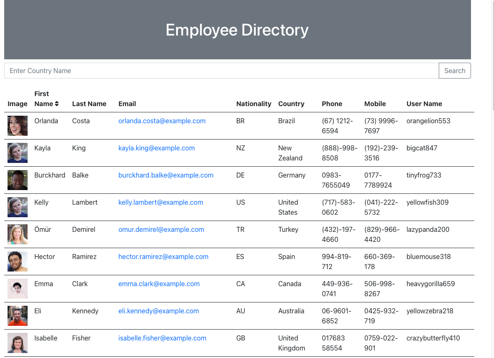
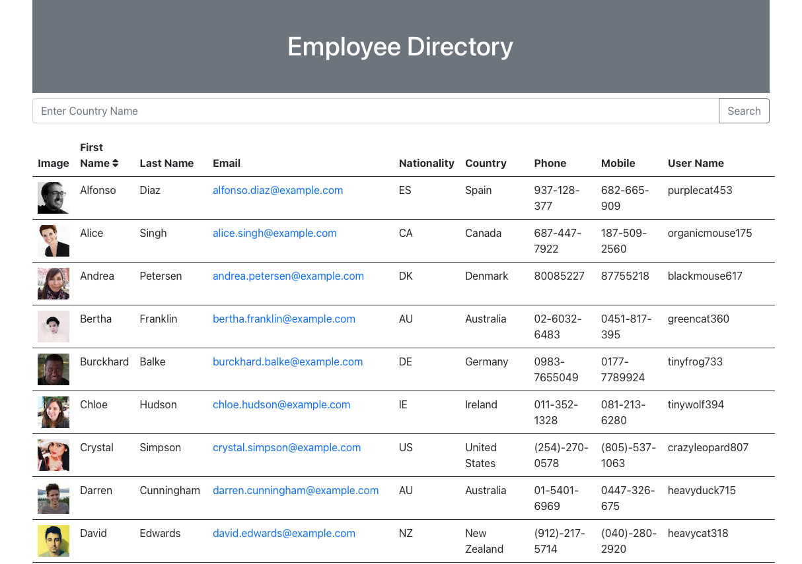
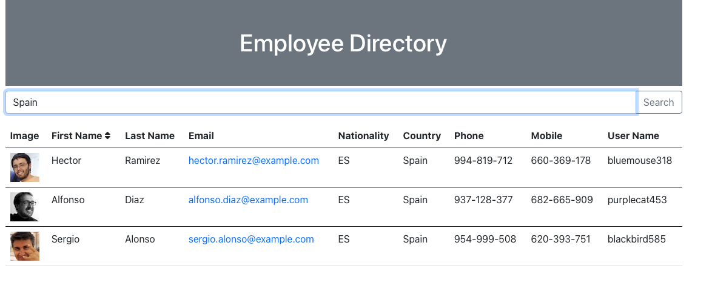

# Employee Directory 
  

## Table of Contents 
- [Employee Directory](#employee-directory)
  - [Table of Contents](#table-of-contents)
  - [Description](#description)
  - [Installation Instructions](#installation-instructions)
  - [Usage](#usage)
  - [Licensing](#licensing)
  - [Contributing](#contributing)
  - [Tests Code](#tests-code)
  - [Images of the Appliication](#images-of-the-appliication)
  - [Access to Functional Applicaton](#access-to-functional-applicaton)
  - [GitHub Direct Link:](#github-direct-link)
  - [Questions](#questions)
    
## Description
    This application pulls a full list of employees of the organization and presents information that is easy to use and interact with on one screen.  The application was developed using react.
    
## Installation Instructions 
    There are no installation instructions required as the application is currently live on heroku.  Please follow the link below to access.  To install locally you would need to create a react app - create-react-app "app name here"  then replace your scr and public folders with those from my repo.  You will then npm start to boot up the application.

## Usage
    Usage of the application is for those looking for non personal information about employees of an organization.  Information such as name, nationality and coutnry is present.  Email address and phone numbers are available to make it easy to contact the employee.  The email can be clicked to directly trigger an email.  Search features allows you to search by country. In addition a sorting feature is available to sort by first name.
    
## Licensing
      

    
## Contributing
    All contributions to improving this application are welcome.
    
## Tests Code
    To test, hit the link to heroku and try it out.  Try the search and the sort option.

## Images of the Appliication
Please find screenshots and a brief video showcasing the application below

## Access to Functional Applicaton

A functioning version of the application can be found here [Heroku](https://bthemployeedirectory.herokuapp.com)

## GitHub Direct Link:  

[Employee Directory--GitHub](https://github.com/daze77/employeedirectory)

    
## Questions
    
You can find me here on [GitHub](http://github.com/daze77), or contact me via [email](mailto:daze77@gmail.com)  
    